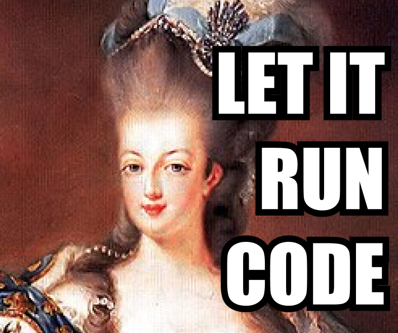

# Container Exec MCP Server



A Model Context Protocol (MCP) server that provides Docker container automation capabilities. This server enables AI assistants like Claude/Cursor/ChatGPT to manage and interact with Docker containers, execute commands, and inspect container information.

This package minimizes the amount of tools to help AI Agents pick the right tool for a given prompt.

## Features

- 🐳 **Container Management** - List and inspect Docker containers
- 🔧 **Command Execution** - Execute commands inside containers
- 📊 **Detailed Information** - Get comprehensive container details
- 🚀 **Dual Transport** - HTTP and stdio (for Claude Code/Cursor)

For detailed information about available tools, see [tools.md](tools.md).

## Table of Contents

- [Container Exec MCP Server](#container-exec-mcp-server)
  - [Features](#features)
  - [Table of Contents](#table-of-contents)
  - [Getting Started](#getting-started)
    - [Prerequisites](#prerequisites)
  - [Configuration](#configuration)
    - [Environment Variables](#environment-variables)
    - [Cursor / Claude Code / Claude Desktop Configuration](#cursor--claude-code--claude-desktop-configuration)
    - [HTTP Transport (for n8n or other HTTP clients)](#http-transport-for-n8n-or-other-http-clients)
  - [Development](#development)
    - [Development Scripts](#development-scripts)
  - [Troubleshooting](#troubleshooting)
    - [Common Issues](#common-issues)
    - [Debug Logging](#debug-logging)
  - [Contributing](#contributing)
  - [License](#license)
  - [Acknowledgments](#acknowledgments)

## Getting Started

### Prerequisites
- Node.js 18 or higher
- Docker installed and running
- npm or yarn

## Configuration

### Environment Variables

Configure the server behavior using environment variables:

| Variable | Description | Default | Options |
|----------|-------------|---------|---------|
| `PORT` | HTTP server port | `4200` | Any valid port number |
| `MCP_AUTH_TOKEN` | Authentication token for HTTP server (optional) | None | Any string |

### Cursor / Claude Code / Claude Desktop Configuration

To use this server with Cursor/Claude Code/Claude Desktop, add it to your MCP settings file.

**Configuration:**
```json
{
  "mcpServers": {
    "container-exec": {
      "command": "npx",
      "args": [
        "container-exec-mcp"
      ]
    }
  }
}
```

> **Note:** After updating the configuration, restart Claude Code/Desktop for changes to take effect.
>
> **Important:** Ensure Docker is running and accessible on your system.

### HTTP Transport (for n8n or other HTTP clients)

Start the HTTP server:
```bash
npm install
npm start
# or with custom port
PORT=4200 npm start

# With authentication (recommended)
MCP_AUTH_TOKEN=your-secret-token npm start
```

The server will listen on `http://localhost:4200/mcp` (or your custom port).

**Authentication (Optional):**

You can secure the HTTP server with token-based authentication by setting the `MCP_AUTH_TOKEN` environment variable. If set, all requests must include the token in the `Authorization` header.

**Example HTTP Request (with authentication):**
```bash
curl -X POST http://localhost:4200/mcp \
  -H "Content-Type: application/json" \
  -H "Authorization: Bearer your-secret-token" \
  -d '{
    "jsonrpc": "2.0",
    "id": 1,
    "method": "tools/call",
    "params": {
      "name": "list_containers",
      "arguments": {
        "all": true
      }
    }
  }'
```

## Development

### Development Scripts

```bash
npm install

# Start HTTP server with auto-reload
npm run dev

# Start stdio server with auto-reload
npm run dev:stdio

# Build TypeScript to JavaScript
npm run build
```

## Troubleshooting

### Common Issues

**1. Docker not running**
```
Error: connect ENOENT /var/run/docker.sock
```
Solution: Start Docker Desktop or the Docker daemon.

**2. Docker permission denied**
```
Error: permission denied while trying to connect to the Docker daemon socket
```
Solution: On Linux, add your user to the docker group: `sudo usermod -aG docker $USER` (then log out and back in).

**3. Node.js version too old**
```
Error: Node.js 18 or higher required
```
Solution: Update Node.js to version 18 or higher.

**4. Container not found**
```
Error: No such container: xyz
```
Solution: Verify the container ID or name with `list_containers`.

**5. Port already in use (HTTP mode)**
```
Error: listen EADDRINUSE: address already in use :::4200
```
Solution: Change the port with `PORT=3001 npm start`

### Debug Logging

For stdio mode, logs are written to stderr and appear in Claude Code logs:
- macOS: `~/Library/Logs/Claude/mcp-server-container-exec-mcp.log`
- Linux: `~/.config/Claude/logs/mcp-server-container-exec-mcp.log`

For HTTP mode, logs appear in the terminal where you started the server.

## Contributing

Contributions are welcome! Please:
1. Fork the repository
2. Create a feature branch
3. Make your changes
4. Run `npm run build` to ensure it compiles
5. Test your changes
6. Submit a pull request

## License

MIT

## Acknowledgments

Built with:
- [Dockerode](https://github.com/apocas/dockerode) - Docker API client
- [Model Context Protocol SDK](https://github.com/modelcontextprotocol/typescript-sdk) - MCP implementation
- [Zod](https://zod.dev/) - Schema validation
- [Express](https://expressjs.com/) - HTTP server
